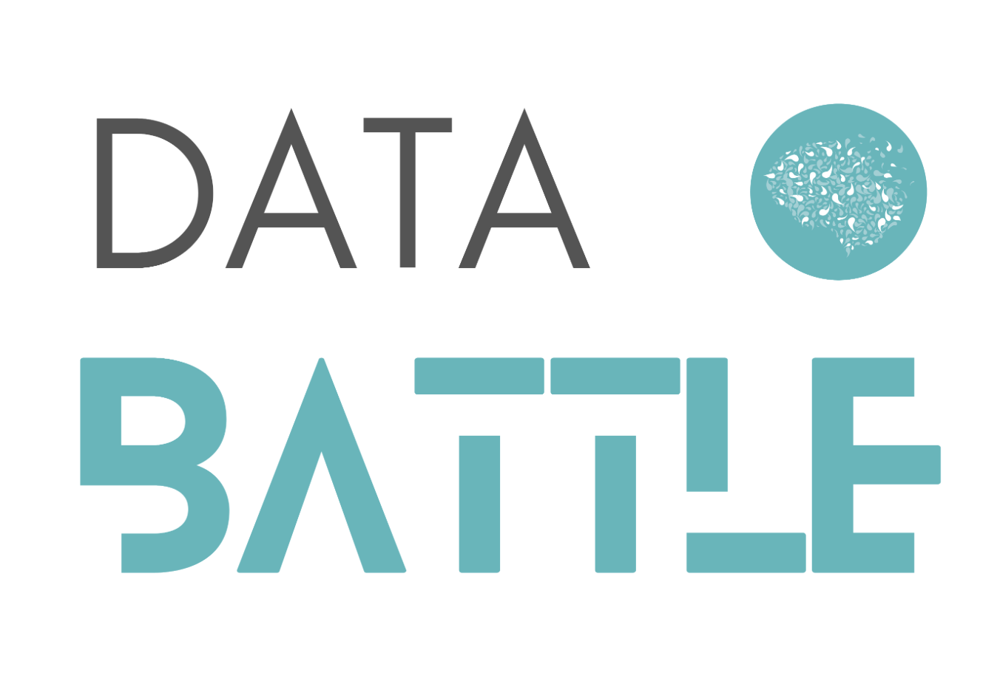
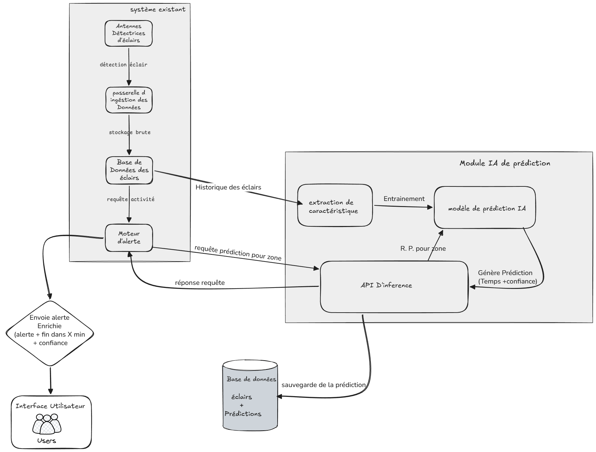

<h1>
	
	Data Battle 2026
</h1>

Projet Data Battle 2026: analyse de donnees d'orages et prediction de fin d'alerte.

## Quick Start

### 1. Creer l'environnement virtuel

Depuis la racine du projet:

```bash
python3 -m venv .venv
```

Activation sur macOS/Linux:

```bash
source .venv/bin/activate
```

Activation sur Windows (PowerShell):

```powershell
.\.venv\Scripts\Activate.ps1
```

### 2. Installer les dependances

```bash
pip install -r requirements.txt
```

### 3. Lancer les notebooks

- `src/notebook/analyse_data.ipynb` : analyse de donnees
- `src/notebook/model.ipynb` : modele predictif

### 4. Lancer la demo Streamlit

```bash
cd src
streamlit run app.py
```

Puis ouvrir l'URL locale affichee dans le terminal.

## Use Case



<h2>
	
	Equipe
</h2>

Nom de l'equipe: `Les marins d'eau douce`

| Membre | Email |
|---|---|
| EL OUADIFI Othmane | othmane.el-ouadifi@grenoble-inp.org |
| OUKHTITE Omar | omar.oukhtite@grenoble-inp.org |
| IDBRAYME Omar | omar.idbrayme@grenoble-inp.org |
| CHLIHI Mohamed Ziyad | mohamed-ziyad.chlihi@grenoble-inp.org |